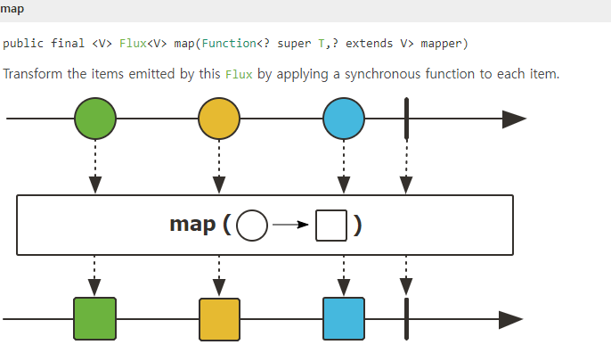
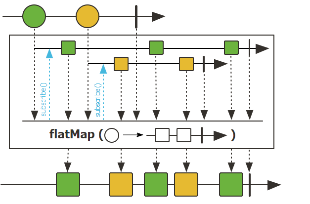
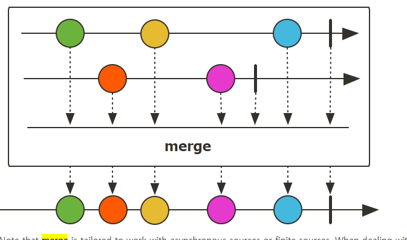
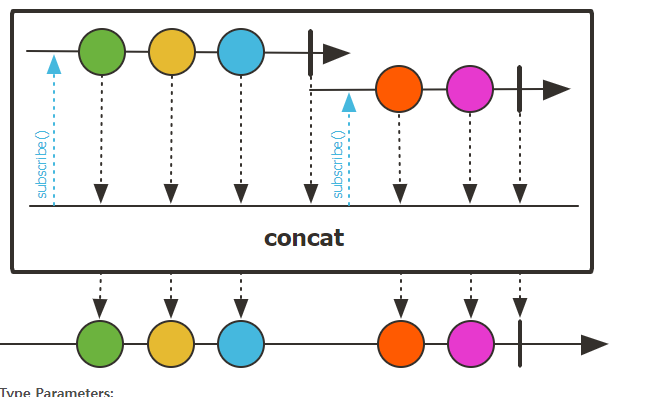
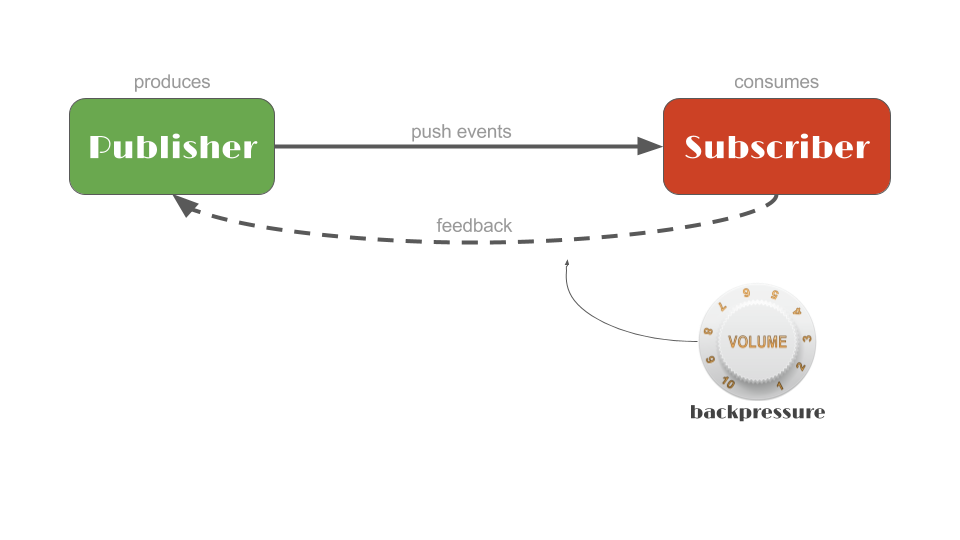

해당 튜토리얼을 풀어본 후 remind 할 것들을 정리함

## 기본개념

Flux 
- 0 to n elements 방출, completes 되거나 error 발생 하거나
- terminal event 가 트리거 되지 않으면 Flux는 무한하다 
- `public static <T> Flux<T> error(Throwable error)` 는 특정 에러로 종료되는 Flux
- `flatMap` 호출 시 inner publisher 가 각기 다른 시간에 도착할 경우, 결과 Flux에 interleaving 될 수 있음 


Mono
- that can emit **at most 1 <T> element **
- Mono is either valued (element 와 함께 완료), empty(element 없이 완료), failed (error) .
- `Mono<Void>`는 completion signal 이 관심사일때 주로 사용된다 (=> `Runnable` 태스크가 완료되었을 때)

StepVerifier
- `reactor-test` artifact, `Publisher` 를 subscribe 하고 시퀀스에 따라 검증함
- `create` 메서드를 통해 `StepVerifier` 인스턴스를 가져올 수 있음 => DSL 제공
- **verify() 메서드나 verifyErrorMessage(String) 메서드(terminal expectation 과 verify를 결합하는) 를 반드시 호출할것**, 호출하지 않으면 StepVerifier는 시퀀스를 subscirbe 하지 않게 된다
```java
StepVerifier.create(T<Publisher>).{expectations...}.verify()
```
- **virtual time** 기능은 `StepVerifier.withVirtualTime(Supplier<Publisher>)` 로 사용할 수 있음 
  - Schedulers (Reactor에서 execution context를 정의하는 컴포넌트) 를 대신하여 VirtualTimeScheduler 가 쓰임 (=> virtual clock이 쓰임)
  - `thenAwait(Duration)`: 시간을 흐르게 함
  - `expectNoEvent(Duration)`: Duration 안에 unexpected event 가 발생할 경우 fail 함 (보통 시간이 지나지 않았을 때 구독(`subscription`) 이벤트가 발생하므로, 이 함수를 쓰기 전에 `.withVirtualTime()` 다음에 `expectSubscription()` 을 호출해야 한다 .. )
     ```java
      StepVerifier.withVirtualTime(() -> Mono.delay(Duration.ofHours(3)))
      .expectSubscription() //subscription 이 먼저 발생
      .expectNoEvent(Duration.ofHours(2)) //그 다음 제한 시간안에 어떠한 이벤트도 발생하지 않아야 함
      .thenAwait(Duration.ofHours(1))
      .expectNextCount(1)
      .expectComplete()
      .verify();
    ```

## operator 정리
- each item 당 sync 하게 적용됨
  


- each item 당 async 하게 적용, interleaving 될 수 있음
  


- flux 가 merge 됨 . interleaving 됨. concat 과는 다르게 source가 즉시 구독됨(eagerly subscribed)
  

- first source 를 먼저 subscirbe 하고, first source 가 완료되면 second source 가 구독됨
  

- `ignoreElements()`: onNext 시그널 무시, termination event 만 전파
  - Mono<Void> 를 리턴해서 completion 시그널만 받고 싶을때: then() 을 호출


## backpressure



feedback mechanism : 
- Subscirber가 Publisher 에게 처리할 준비가 된 데이터 양을 signal 로 보내고
Publisher의 데이터 생성 속도를 제한함 
- Subscription level 에서 조정됨,`request(long)` 을 호출함으로써 요청을 조절한다
- 즉 request(Long.MAX_VALUE) 는 무제한 요청을 의미하며, Publisher는 데이터를 빠른 속도로 emit 하게 됨 

## log & side effect
- log()
- event 에 side-effect 추가 : methods that start with `do`/`doOn`
  - 특정 action 에 side-effect, BUT 주의점은 blocking 되는 연산이나 latency가 있는 operation 을 수행하면 안됨 
  - (참고): https://projectreactor.io/docs/core/release/reference/index.html#which.peeking

## dealing-with-error

- onErrorReturn: simply emit **a captrued fallback value** 
- onErrorResume: subscirbe to a **a fallback publisher**
- `Exceptions#propagate`: checked exception 을 runtime exception으로 래핑,`Subscriber.onError(Throwable)` 으로 downstream에 전파되게 됨. Stepverifier는 이걸 다시 unwrapped 해서 상관없는 runtimeException 이 안보이게 함


## Scheduler
- 흠.. 뭔가 코루틴으로 치면 코루틴 디스패처를 바꾸는 느낌인건가?
- blocking operation 을 `Scheduler` 를 이용한 별도의 execution context로 분리하고 싶을 때 사용함

- subscribeOn: 시퀀스를 처음 시작부터 정의된 Scheduler로 격리하고 싶을 때
  - Schedulers.boundElastic(): 요구에 따라 증가하는 스레드 풀 생성, 오랫동안 이용되지 않은 스레드를 자동 해제시켜 준다 .. 스레드가 너무 많이 생기는걸 방지하기 위해서 upper limit 이 존재

- publishOn: slow subscriber 일때 주로 사용(e.g. save to database), small section of sequence를 격리하고 싶을 때 사용
  chain 아래에 있는 것부터 Schedulers 가 스위치 되서 적용된다

- `Schedulers.immediate`: 현재 실행 스레드에서 즉시 실행, no execution context
- `Schedulers.single`: same thread 를 재사용 .. 만약 1 call 마다 새로운 스레드를 만들고 싶으면 `Schedulerse.newSingle()` 호출
- `Schedulers.boundedElastic()`: blocking process 전용 스레드플. I/O blocking 작업을 할 때 유리, 너무 많은 스레드를 생성하지 않도록 함 
- `Schedulers.parallel()`: CPU core 만큼 woorker 생성 .. (Schedulers.newParallel(schedule-name) 하면 parallel scheduler 생성)

e.g.
```java
Mono blockingWrapper = Mono.fromCallable(() -> { 
    return /* make a remote synchronous call */ 
});
blockingWrapper = blockingWrapper.subscribeOn(Schedulers.boundedElastic()); 
```
it creates a dedicated thread to wait for the blocking resource without impacting other non-blocking processing, while also ensuring that there is a limit to the amount of threads that can be created, and blocking tasks that can be enqueued and deferred during a spike.